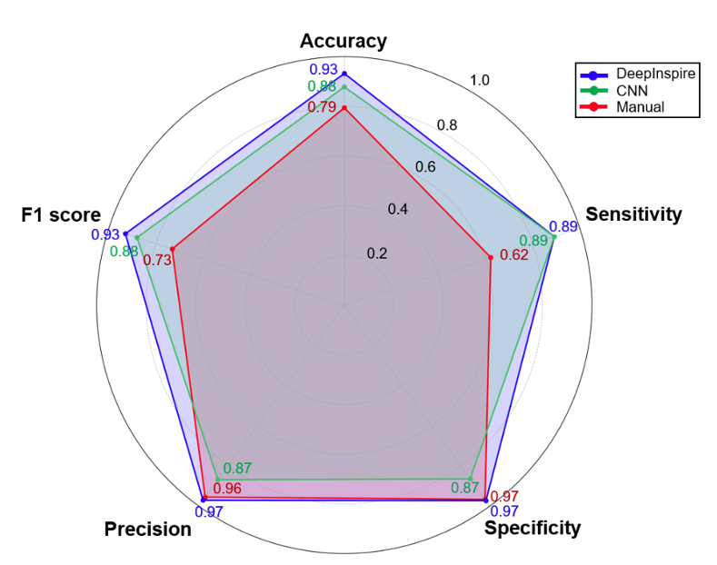
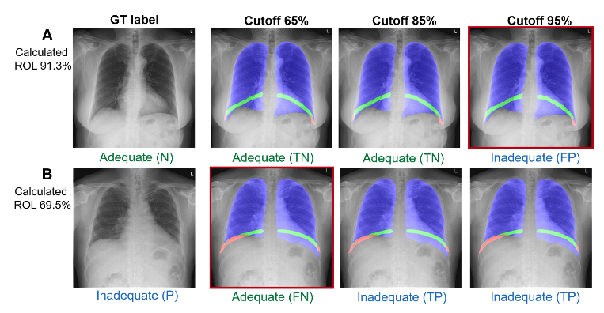

# DeepInspire 🩻

This repository contains the code use in **DeepInspire** study, which focuses on automated assessment of inspiration quality in chest X-ray images using deep learning frameworks.

The Dataset and Model can be accessed through this [links](https://drive.google.com/drive/folders/12fRIySjRqLX0YwEICfnESx56OoYk0zR6?usp=share_link)


## Overview

**DeepInspire** evaluate inspiration quality in chest X-ray images by calculate **Rib Over Lung (ROL)** value, which is percentage of posterior rib 9th area over lung area. The optimal ROL cutoff of 83.9% was use in our study to determine whether a chest X-ray shows adequate (full) or inadequate (not full) inspiration. The study show that DeepInspire can achieve higher performance in assessing inspiration quality compare to human interpretation and using classification models.




## Repository Structure

```
DeepInspire/
├── train_classification.py     # Training script for classification model
├── train_segment.py            # Training script for segmentation models
├── Notebook/                   # Jupyter notebooks for evaluation
│   ├── evaluation.ipynb        # Notebook for model evaluation and testing
│   └── visualization.ipynb     # Notebook for results visualization
└── Image/                      # Experimental results
    ├── show.png                # Example visualization of segmentation results for lung and rib segmentation models and using ROL cutoff to determine inspiration quality
    └── performance.png         # Radar plot showing performance comparison between DeepInspire, human observers, and classification models
```

## Environment Setup

Before running any training scripts or notebooks, it is recommended to create a virtual environment and install dependencies:

```bash
python -m venv .venv
source .venv/bin/activate
pip install -r requirements.txt
```

## Training

### Classification Model

The classification model can be trained using the following command:

```bash
python train_classification.py
```

**Key parameters:**
- `--train_folder`: Path to training data (default: `Dataset/train`)
- `--valid_folder`: Path to validation data (default: `Dataset/validation`)
- `--n_epochs`: Number of training epochs (default: 100)
- `--learning_rate`: Learning rate (default: 0.0001)
- `--train_batch_size`: Batch size for training (default: 4)

### Segmentation Models

The segmentation models can be trained using the following commands:

```bash
# Train rib segmentation model
python train_segment.py --organ rib

# Train lung segmentation model
python train_segment.py --organ lung
```

**Key parameters:**
- `--organ`: Target organ ('rib' or 'lung')
- `--train_data_dir`: Path to training data (default: `Dataset/train`)
- `--valid_data_dir`: Path to validation data (default: `Dataset/validation`)
- `--n_epochs`: Number of training epochs (default: 100)
- `--learning_rate`: Learning rate (default: 0.0001)
- `--encoder`: Encoder backbone (default: 'resnet34')

## Evaluation and Testing

For model evaluation and testing, use the Jupyter notebooks in the `Notebook/` folder:

1. **evaluation.ipynb**: Comprehensive model evaluation on test datasets
2. **visualization.ipynb**: Visualization of results and comparison with baselines

To run the notebooks:
```bash
jupyter notebook Notebook/evaluation.ipynb
```

## Requirements

- Python 3.8+
- PyTorch
- torchvision
- segmentation-models-pytorch (smp)
- albumentations
- OpenCV
- NumPy
- scikit-learn
- matplotlib
- tqdm

## Citation

If you use this code or models in your research, please cite the DeepInspire study.

## License

This repository is provided for research purposes. Please contact the authors for licensing information.
